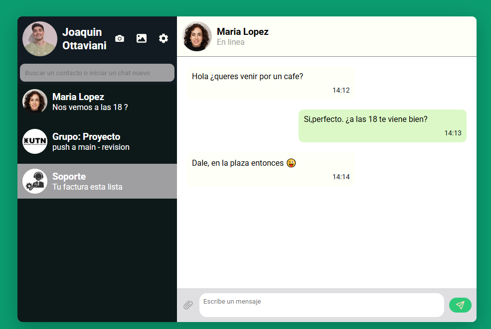

# Proyecto Base
## Maquetacion estilo Whatsapp

### Descripcion
Este proyecto es una aplicación web que simula la experiencia, de un usuario, en una app o pagina web como Whatsapp. 

### Qué es el proyecto
El proyecto consiste en un sistema de chat en línea que permite una comunicación fluida y eficiente. Utiliza un diseño responsive, asegurando que sea accesible desde dispositivos móviles y de escritorio.

### Qué parte de la imagen se reprodujo
En este proyecto recreamos la sección del panel de chat, donde los usuarios pueden ver mensajes recientes, enviar nuevos mensajes.  

### Qué tecnologías usaron
- **HTML**: Este archivo contiene la estructura HTML principal de la página. En él se encuentran los elementos clave de la interfaz dividida en dos columnas. 
A la izquierda: El Menu aside con su header, la barra de search y los contactos. 
A la derecha: El chatbox con su heder, la seccion messages y el footer. 

 Además, el archivo incluye enlaces a las hojas de estilo CSS 
- **CSS**: El archivo contiene los estilos organizados de manera logica segun su aparicion, ademas se ha utilizado un enfoque responsivo para que el proyecto sea adaptable a diferentes tamaños de pantalla.

## Cómo visualizarlo

Para visualizar el proyecto, simplemente abre el archivo `index.html` en cualquier navegador web.

1. Descarga o clona el proyecto.
2. Navega a la carpeta del proyecto.
3. Abre `index.html` en tu navegador 

## Diseño

El diseño de la aplicación se organiza en una estructura de dos columnas utilizando **CSS Grid**, optimizando el espacio disponible en pantallas grandes y adaptándose a dispositivos más pequeños a través de **media queries**.

### Componentes Principales:
1. **Panel Lateral (Aside)**:
   - Muestra el perfil del usuario, con una imagen de perfil y nombre.
   - Incluye un conjunto de botones de acción representados por íconos SVG, que permiten la interacción con la aplicación (por ejemplo, enviar un mensaje, ver notificaciones, etc.).
   - Barra de búsqueda para encontrar contactos y chats fácilmente.

2. **Panel de Chat**:
   - Contiene el historial de mensajes, organizados en una columna.
   - Los mensajes del usuario y del destinatario se distinguen por colores y alineación.
   - Los mensajes incluyen una marca de tiempo para cada mensaje.

3. **Pie de Página (Footer)**:
   - Incluye un área para escribir nuevos mensajes, un botón de adjuntar archivo, y un botón de envío.
   - Los botones son minimalistas, con iconos SVG que ofrecen una experiencia de usuario intuitiva.

## Estilo Visual

### Colores
La paleta de colores está pensada para ofrecer un contraste adecuado y una apariencia profesional, sin ser demasiado brillante ni intrusiva:
- **Colores principales**: 
  - Verde primario: `#0a9c6f`
  - Variaciones de grises para fondos y texto: `--grey-900`, `--grey-800`, `--grey-300`, etc.
- Los colores ayudan a resaltar los elementos interactivos, como botones y áreas de entrada de texto.

### Tipografía
Se utiliza la fuente **Roboto**, una fuente sans-serif moderna y legible, para todo el contenido de la interfaz.

### Iconos y Botones
- Se emplean **iconos SVG** para representar acciones clave como enviar mensajes, adjuntar archivos, y otras interacciones.
- Los botones cuentan con transiciones y animaciones sutiles para mejorar la interacción (por ejemplo, al pasar el cursor sobre ellos).

## Git Hub
Se creo un repositorio en el cual se encuentran los diferentes commits. Cada uno de ellos refleja un cambio específico en el desarrollo, lo que facilita el seguimiento del progreso y la colaboración en el proyecto.